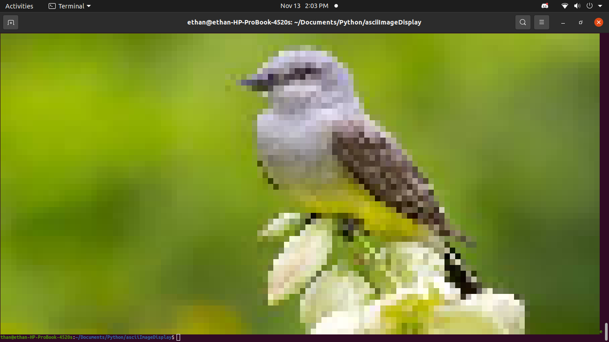

# terminal-photo-viewer
view images in the terminal using ansi escape codes and python



### !! Only tested on `Ubuntu 20.04.3 LTS` with `python version 3.8.10`

## Dependencies
### `Pillow`
To install:
```
python3 -m pip install --upgrade pip
python3 -m pip install --upgrade Pillow
```


## `main.render(file_path) -> string`
returns a string of ansi escape codes to change colour and two spaces to make it square
